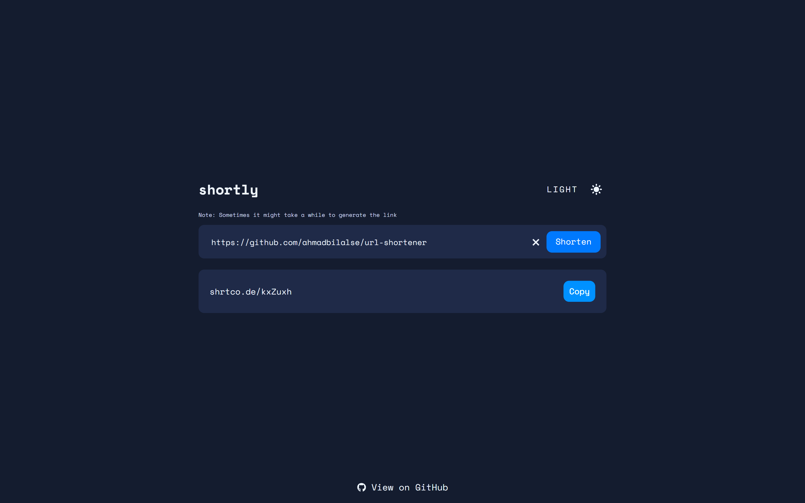

# URL shortener

URL shortener with dark/light theme switcher

## Tech Stack
- React
- Next.js
- Zustand
- Sass
- REST API

## Acknowledgments
- [URL shortening API landing page challenge on Frontend Mentor](https://www.frontendmentor.io/challenges/url-shortening-api-landing-page-2ce3ob-G)
- [shrtcode API](https://shrtco.de/)
